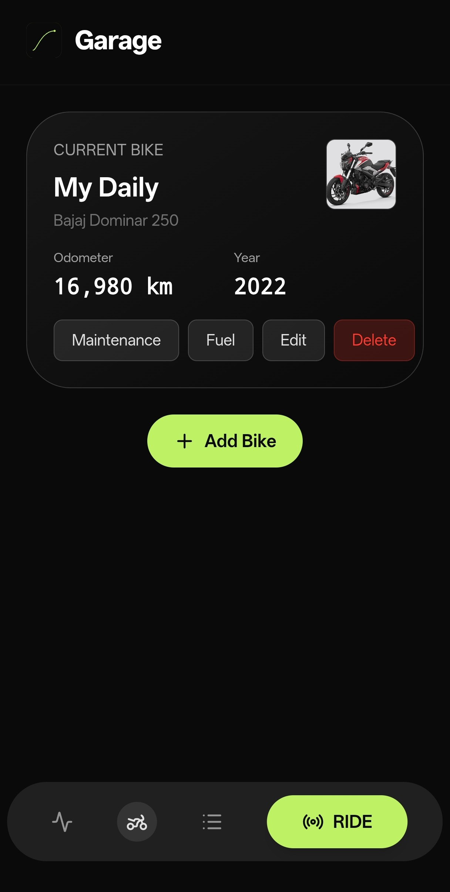
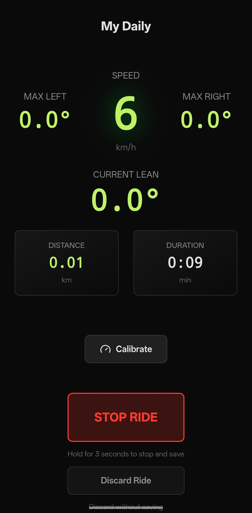
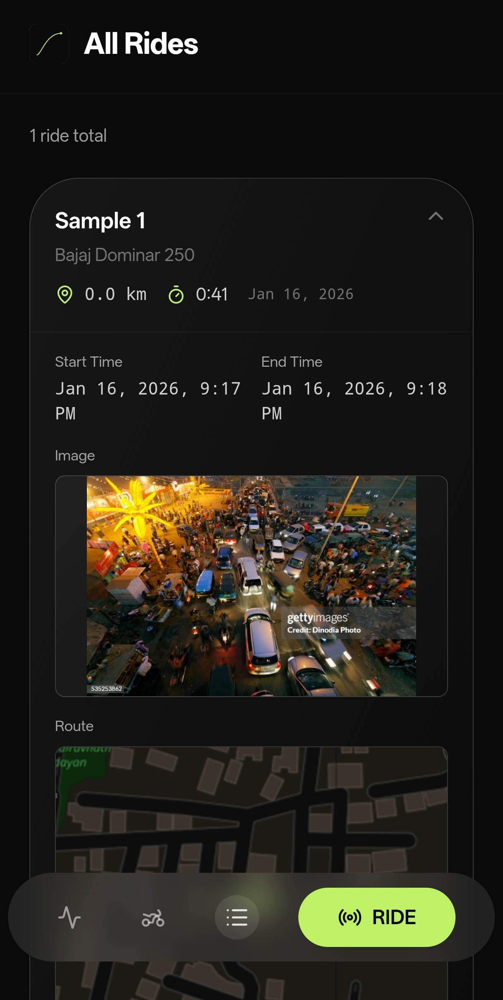
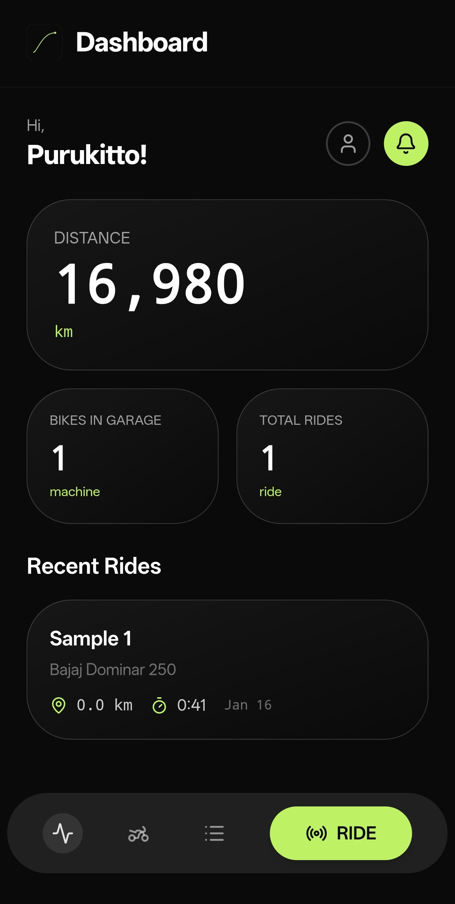

  
  
  # Apex: The Rider's Black Box
  
  A minimalist, high-precision utility for motorcyclists. Apex is a "Flight Recorder" for the road and a "Digital Garage" for the machine.
  
  
  
  
  

## 🎯 What is Apex?

Apex combines real-time ride tracking with comprehensive maintenance management, designed with the philosophy of **"The Dark Cockpit"** - optimized for OLED displays, high contrast, and instrument-grade precision.

Whether you're tracking your weekend rides or managing a fleet of motorcycles, Apex provides the tools you need to monitor your machines and your adventures.

## ✨ Features

### 🏍️ The Garage
- **Multi-bike Management**: Track multiple motorcycles in your fleet
- **Maintenance Logs**: Comprehensive service history tracking with detailed records of all maintenance work performed, including parts replaced, service dates, costs, and odometer readings at service time
- **Maintenance Schedules**: Set up custom service intervals (time-based and distance-based) for different parts and components
- **Service Reminders**: Automatic notifications when maintenance is due based on time or mileage thresholds
- **Odometer Tracking**: Monitor mileage for each bike with automatic updates from ride recordings
- **Fuel Logging**: Track every refuel with fuel consumption, efficiency (km/L or MPG), cost per kilometer, and fuel price history. Calculate average mileage and identify trends in fuel economy

### 📍 The Recorder
- **GPS Tracking**: Real-time route recording with detailed path visualization
- **Telemetry**: Speed, lean angle, G-force, and altitude tracking
- **Ride History**: View past rides with detailed statistics and maps
- **Share Rides**: Export and share your ride data

 

### 📊 The Dashboard
- **Current Status**: Overview of all bikes and their maintenance status
- **Last Ride Summary**: Quick access to recent ride data
- **Maintenance Alerts**: Warnings for upcoming service intervals

### 🔗 Discord Integration
- **Status Sharing (Android, experimental)**: Share your ride status

> Warning: This app uses the Discord Gateway connection. Use this at your own risk. However people have been using custom rich presence for past 4-5 years and there is still no case of account getting terminated.

## 🎨 Design Philosophy

### The Dark Cockpit

Apex is designed with the rider in mind, especially for use on mobile devices during rides:

- **OLED First**: Pure black backgrounds (`#0A0A0A`) to save battery and reduce glare
- **High Contrast**: White and Apex Green (`#3DBF6F`) for critical data visibility
- **Instrument Grade**: Monospaced fonts (JetBrains Mono) for telemetry precision
- **Glove-Friendly**: Large touch targets, long-press for destructive actions
- **Smooth Animations**: Subtle, high-end transitions for a polished experience

For more details on the design philosophy and Discord integration, see [DOCS.md](DOCS.md).

## 📥 Download & Install

### For End Users

Apex is available as a mobile app for iOS and Android:

- **Android**: Download the latest APK from [GitHub Releases](https://github.com/Purukitto/apex-app/releases/latest)
- **iOS**: Coming soon (App Store submission in progress)
- **Web**: Access the web version at [apex.purukitto.xyz](https://apex.purukitto.xyz)

### Installation Instructions

1. **Android**:
   - Download the latest `apex-*.apk` file from the [releases page](https://github.com/Purukitto/apex-app/releases/latest)
   - Enable "Install from Unknown Sources" in your Android settings
   - Open the downloaded APK file and follow the installation prompts

2. **iOS**:
   - Installation instructions will be available once the app is published to the App Store

3. **First Launch**:
   - Create an account or sign in
   - Add your first motorcycle to get started
   - Grant location permissions for ride tracking

## 🚀 Getting Started

Once installed:

1. **Create an Account**: Sign up with your email or use social authentication
2. **Add Your Bike**: Go to the Garage and add your motorcycle(s)
3. **Set Up Maintenance**: Configure service intervals for your bike
4. **Start Recording**: Use the Recorder to track your rides

## 📚 Documentation

For more information:

- **[DEVELOPER.md](DEVELOPER.md)** - Developer setup and technical documentation
- **[ARCHITECTURE.md](ARCHITECTURE.md)** - System architecture and data flow
- **[DOCS.md](DOCS.md)** - Design philosophy and core pillars
- **[CHANGELOG.md](CHANGELOG.md)** - Version history and release notes
- **[CONTRIBUTING.md](CONTRIBUTING.md)** - Guidelines for contributing

## 📊 Analytics

Apex uses [Vercel Analytics](https://vercel.com/analytics) to collect anonymous usage statistics and performance metrics. This helps us understand how the app is being used and identify areas for improvement. All analytics data is collected in compliance with privacy best practices and does not include personally identifiable information.

## ☕ Support Development

Apex is free and open-source. If it helps you, consider supporting development:

- **[Buy Me a Coffee](https://buymeacoffee.com/purukitto)** — One-time support ($)
- **UPI** — `apex-app@axl` (India, ₹) — *Payee: Apex Development*

## 🤝 Contributing

We welcome contributions! Please see [CONTRIBUTING.md](CONTRIBUTING.md) for guidelines on how to contribute to this project.

## 📄 License

This project is licensed under the GNU General Public License v3.0 - see the [LICENSE](LICENSE) file for details.

## 🙏 Acknowledgments

Maps © [OpenStreetMap](https://www.openstreetmap.org/copyright) contributors

Discord RPC approach inspired by [Kizzy](https://github.com/dead8309/Kizzy)

---

  Made with ❤️ for the motorcycle community

